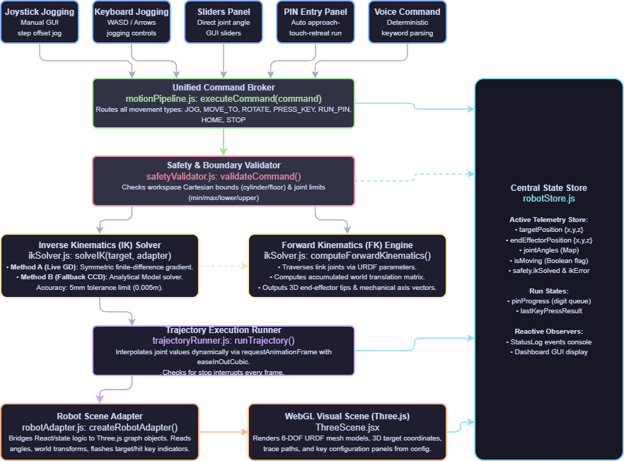
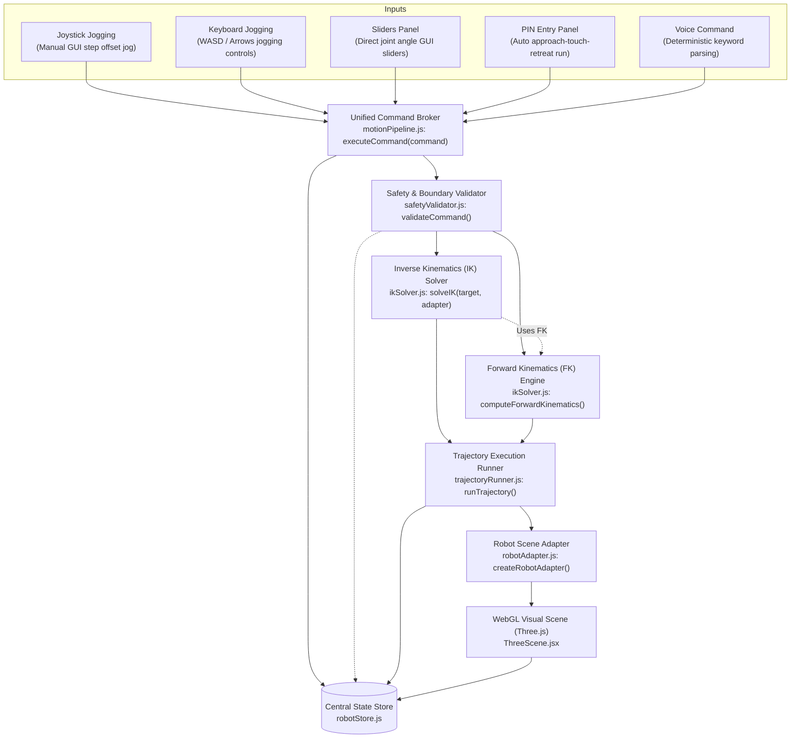
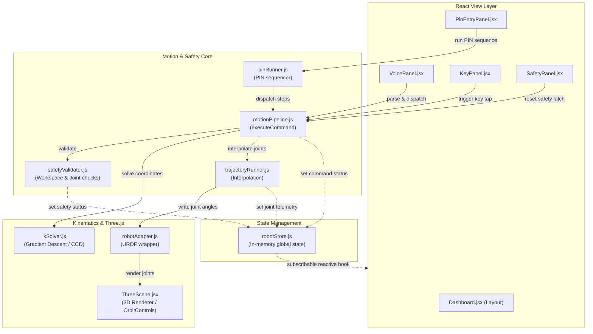

# Vantage Arm

> Browser-based 6-DOF robotic arm simulation and control suite — built for the Vantage_Arm hackathon.

Vantage Arm renders a URDF robotic arm with a stylus tip in the browser and
exposes a single shared motion pipeline that every input source (dashboard,
keyboard, on-screen joystick, deterministic voice, typed voice, autonomous PIN
entry) calls into. The result is a presentation-friendly operator dashboard
that visualises the arm and the 6-key test panel defined in `key.config.json`,
with end-effector jogging, joint jogging, voice control, and autonomous PIN
entry.

---

## Local Setup

```bash
# 1. Install dependencies
npm install

# 2. Run the dev server (Vite, http://localhost:5173)
npm run dev

# 3. Production build
npm run build

# 4. Preview the built bundle
npm run preview
```

Requires Node 18+ (Vite 5).

---

## System Architecture & Pipeline

The project strictly follows a **Single Shared Motion-Control Pipeline**. Every input method must construct a structured command and dispatch it via the central entry point: `executeCommand(command)` in `src/core/motionPipeline.js`. Direct modification of the 3D model positions or bypasses of the safety validation module are forbidden.

### 🗺️ Visual Architecture Blueprint
For a high-resolution visual layout of the motion-control pipeline, components, and solver lifecycles, see the official blueprint:


---

### 🔄 Overall Motion-Control Pipeline Flow
This flowchart traces the lifecycle of a command from trigger through safety verification, kinematic solving, interpolation, and final visual rendering:



---

### 🧩 Component Relationship Diagram
This diagram shows the boundaries and flow of state between the **React UI layer**, the **central store**, the **safety core**, and the **3D rendering engine**:



---

### 📂 Module Map

| Layer | Files | Description |
| --- | --- | --- |
| **Command & Pipeline** | `src/core/commandTypes.js`<br>`src/core/motionPipeline.js` | Enforces structural schemas/scales and runs the main `executeCommand` broker. |
| **State Store** | `src/core/robotStore.js` | In-memory subscribable active telemetry and safety log database. |
| **Safety & Trajectory** | `src/core/safetyValidator.js`<br>`src/core/trajectoryRunner.js`<br>`src/core/pinRunner.js` | Prevents collisions/workspace limits, runs ease-in-out trajectory loops, and schedules PIN steps. |
| **Kinematics Engine** | `src/robotics/ikSolver.js`<br>`src/robotics/robotAdapter.js` | Solves Cartesian target joint states using GD + CCD (with perturbation retries) and compute FK. |
| **3D Visualization** | `src/scene/ThreeScene.jsx`<br>`src/scene/ArmModel.jsx`<br>`src/scene/KeyPanel.jsx`<br>`src/scene/TrajectoryLine.jsx` | Renders WebGL scene grids, URDF meshes, active path tracings, and key lights. |
| **Control Adapters** | `src/controls/keyboardCommands.js`<br>`src/controls/voiceCommandParser.js` | Normalizes physical inputs and spoken sentences into standard commands. |
| **Operator GUI** | `src/components/Dashboard.jsx`<br>`StatusLog.jsx`<br>`SafetyPanel.jsx`<br>`KeyPressPanel.jsx` | Renders responsive widgets, feedback logs, error bounds, and test keys. |

---

### 📝 Command Schema
All input adapters serialize their payloads conforming to the schema definitions in `commandTypes.js`:

```js
{
  type: 'jog' | 'moveTo' | 'pressKey' | 'runPin' | 'home' | 'stop' | 'rotateJoint',
  payload: {
    /* Command-specific payload keys, e.g.:
       jog:         { axis: 'x'|'y'|'z', delta: number }
       moveTo:      { target: { x, y, z } }
       pressKey:    { key: string }
       runPin:      { pin: string }
       rotateJoint: { jointName: string, deltaDeg: number }
    */
  },
  source: 'keyboard' | 'joystick' | 'dashboard' | 'voice' | 'pin-panel'
}
```

---

## Current Progress — Phase E (Voice Control)

All Phase E features are fully integrated, providing unified motion control, key-press automation, autonomous PIN entry, and voice control via Web Speech API:

- **Dashboard Layout**: Rich 6-DOF controls and visualizer with live joint updates, safety panel integration, and chronological Status Log.
- **Inverse Kinematics (IK) & Trajectories**: Features a high-performance, Jacobian-free numerical gradient descent solver running at 60Hz. It accurately resolves Cartesian coordinates to joint states within a 5mm tolerance, smoothly animated by ease-in-out cubic trajectories.
- **Autonomous key tapping**: The **Press Key** panel supports direct triggers for Keys 1-6. Clicking a key initiates a multi-stage approach (hover 5cm above), touch (descend to surface), contact flash, and retreat sequence.
- **Sequential PIN Entry**: The **Autonomous PIN** panel executes sequential key pressing routines for 6-digit PIN strings consisting of digits 1-6. Includes live progress tracking, per-key error distance visualization, and mid-sequence emergency stop.
- **Advanced Visual Feedback**: In the 3D scene, target markers dynamically change color per movement phase (Cyan=approach, Gold=touch, Green=retreat) with an active trajectory line tracking the end-effector path. Keys highlight when active and persist a green glow when successfully pressed.
- **Voice Control (Deterministic)**: The **Voice** panel connects directly to the browser's Web Speech API (where supported) to listen to operator commands like "move up", "press key five", "rotate base 30 degrees", and "enter pin 123456". It parses commands strictly via a deterministic engine and provides text-to-speech (TTS) feedback. A typed fallback is provided as a primary backup for unsupported browsers.

### Controls Reference (Phase E)

| Source        | UI                          | Adapter / dispatch                             | Pipeline command |
| ------------- | --------------------------- | ---------------------------------------------- | ---------------- |
| Press Key     | `KeyPressPanel` buttons     | `executeCommand`                               | `pressKey`       |
| Joystick      | `JoystickPanel` buttons     | `createJoystickAdapter`                        | `jog` / `home` / `stop` |
| Move To       | `TargetInputPanel` form     | inline `executeCommand`                        | `moveTo`         |
| Keyboard      | window listener             | `createKeyboardAdapter` (W/A/D + Q/E + H/Space)| `jog` / `home` / `stop` |
| Voice (Mic)   | `VoicePanel` mic / text     | `parseAndExecuteVoiceCommand`                  | *various*        |
| Autonomous PIN| `PinEntryPanel` presets     | inline `executeCommand`                        | `runPin` / `stop` |
| Safety        | `SafetyPanel` buttons       | inline `executeCommand`                        | `halt` / `resetSafety` |

---

## Demo Instructions (Phase E)

To perform the Phase E judging demo:
1. Run `npm run dev` and open the app.
2. Verify the 3D scene renders the robotic arm and the 6-key panel.
3. Use **Voice Control**:
   - If your browser supports it (e.g. Chrome), click **Start Listening** in the Voice panel and allow microphone permissions.
   - Say "move up". The arm should jog upwards.
   - Say "press key five". Watch the multi-stage touch sequence.
   - Say "rotate base 30 degrees". Observe the arm rotate at the base.
   - If speech recognition fails or is unsupported, type these exact commands into the Voice panel text box and press Enter (or click Run).
4. Run the Autonomous PIN sequence via voice:
   - Say or type "enter pin 123456".
   - Observe the trajectory line and phase-colored markers tracing the entire entry path.
5. Review the **Status Log**:
   - Observe how voice inputs are logged, parsed, and executed natively via the single `executeCommand` pipeline, inheriting all safety validators.

