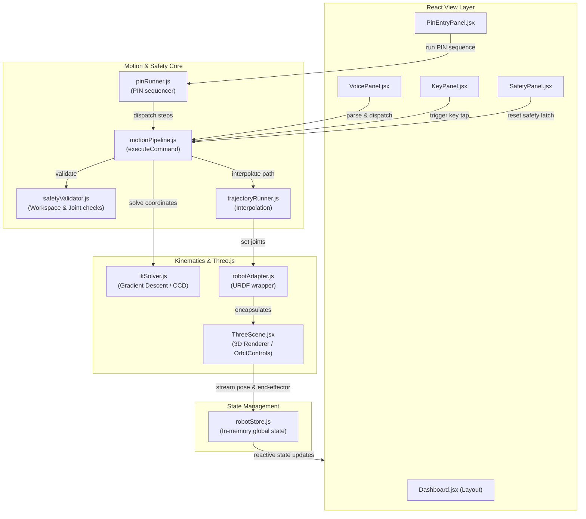

# Vantage Arm — System Architecture & Motion-Control Pipeline

This document outlines the detailed system architecture and execution pipeline of the **Vantage Arm** 6-DOF robotic simulation suite. It serves as a comprehensive reference for judging and technical review.

> [!TIP]
> **Editable Draw.io Diagram Available**
> A native, fully laid-out Draw.io diagram file is located at [docs/vantage_arm_pipeline.drawio](file:///d:/WebDev/Hackathon/RS%20Techathon/Vantage_Arm/docs/vantage_arm_pipeline.drawio). You can open or drag-and-drop this file directly into [draw.io](https://app.diagrams.net/) to instantly view and edit the high-fidelity pipeline graph.

> [!IMPORTANT]
> **Single Shared Pipeline Rule**
> The system enforces a strict single-entry motion control pipeline: **all** inputs (UI controls, keyboard, voice, and autonomous routines) must construct a structured command and dispatch it via the central entry point: `executeCommand(command)`.

---

## 1. Overall Motion-Control Pipeline Flow
This diagram illustrates the step-by-step lifecycle of a command as it flows from an input trigger through safety validation, kinematic resolution, trajectory execution, and finally to the visual updates of the 3D model.

```mermaid
flowchart TD
    %% Input Layer
    subgraph Inputs ["1. Input Methods"]
        UI_Slider["Dashboard Sliders"]
        UI_Joy["GUI Joystick (Jog)"]
        UI_Keys["Dashboard Key Press"]
        Kbd["Keyboard (WASD / Arrows)"]
        Voice["Voice Command Parser"]
        Pin["Autonomous PIN Runner"]
    end

    %% Command Creation
    Inputs -->|Generates Command| CmdStruct["Structured Command\n(commandTypes.js)"]

    %% Pipeline Processing
    subgraph Pipeline ["2. Shared Motion Pipeline (motionPipeline.js)"]
        Entry["executeCommand(command)"]
        SafetyGate{"safetyValidator.js\n(Limits Check)"}
        IK_Gate{"Is Cartesian Target?"}
        IK_Solve["ikSolver.js\n(Numerical GD / CCD)"]
        Traj_Gen["trajectoryRunner.js\n(Joint Trajectory)"]
    end

    CmdStruct --> Entry
    Entry --> SafetyGate
    
    %% Safety Outcomes
    SafetyGate -->|Invalid / Limit Exceeded| TripSafety["Trip Safety State\n(Store: safety.lastValid = false)"]
    SafetyGate -->|Valid| PassSafety["Clear Safety Latch\n(Store: safety.lastValid = true)"]
    
    TripSafety --> LogError["Log Error to Status Log"]
    PassSafety --> IK_Gate

    %% Kinematic Layer
    IK_Gate -->|Yes| IK_Solve
    IK_Gate -->|No (Joint Angle Command)| Traj_Gen
    
    IK_Solve -->|IK Failed to Converge| LogError
    IK_Solve -->|IK Solved| Traj_Gen

    %% Execution Layer
    subgraph Execution ["3. Model & UI Updates"]
        Traj_Run["Run Trajectory\n(Interpolates over time)"]
        Adapter["Robot Adapter\n(robotAdapter.js)"]
        Store["Robot Store\n(robotStore.js)"]
        Canvas["Three.js scene\n(ThreeScene.jsx)"]
    end

    Traj_Gen --> Traj_Run
    Traj_Run -->|Iterative updates| Adapter
    Adapter -->|Sets Joint Angles| Canvas
    Canvas -->|Streaming feedback| Store
    Store -->|Reactive bindings| UI_Display["Dashboard UI Displays"]
```

---

## 2. Component Relationship Diagram
This diagram shows how different architectural blocks of the application are integrated. It highlights the boundary between the **React UI layer**, the **central state store**, the **kinematic engine**, and the **Three.js rendering engine**.



---

## 3. Detailed Component Breakdown

| File Name | Domain | Primary Responsibility | Key Features |
| :--- | :--- | :--- | :--- |
| `commandTypes.js` | Core | Defines the structural schemas, scales, and types for all commands. | Enforces strict validation shapes; prevents corrupted command payloads. |
| `motionPipeline.js` | Core | Orchestrates execution, coordinates logging, and delegates actions. | Single entry point (`executeCommand`); manages trajectory execution and target markers. |
| `safetyValidator.js` | Core | Validates commands against physical constraints *before* execution. | Prevents self-collision; monitors joint limits; verifies coordinates are inside workspace bounds. |
| `robotStore.js` | Core | In-memory central state management. | Subscribable store; records active commands, safety states, and real-time joint positions. |
| `trajectoryRunner.js` | Core | Computes and interpolates paths between poses. | Generates cubic/linear joint profiles; handles smooth transition steps over time. |
| `pinRunner.js` | Core | Coordinates autonomous PIN sequences. | Translates 6-digit sequence to individual key movements (approach $\to$ touch $\to$ retreat). |
| `ikSolver.js` | Robotics | Translates $(x, y, z)$ Cartesian targets into joint angles. | Two-stage solver (Numerical Gradient Descent + CCD Fallback) with a **singularity perturbation retry loop**. |
| `robotAdapter.js` | Robotics | Bridges the motion pipeline with the 3D visual simulation. | Provides setter/getter wrappers for joint states, end-effector position, and key visual states. |
| `voiceCommandParser.js`| Controls | Parses text/speech inputs into structured commands. | Handles digit-word replacement, trailing punctuation removal, and degree symbol (`°`) conversion. |

---

## 4. Key Engineering & Integration Patterns

### A. The No-Bypass Safety Gate
Every command passing through `executeCommand` is subjected to validation in `safetyValidator.js`. If a boundary is crossed or a limit is breached:
1. The execution is halted immediately.
2. The global safety latch is tripped (`safety.lastValid = false`).
3. The system rejects all subsequent movement commands until an operator explicitly triggers `resetSafety`.

### B. Singularity Resolution (Straight-Arm Issue)
When the robotic arm starts from its straight-up home pose ($[0,0,0,0,0,0,0]$), it sits in a **coordinate singularity**. In this state, small changes to individual joints do not improve the vertical distance error without increasing the horizontal error, causing simple gradient descent and CCD solvers to fail.

To resolve this, our IK Solver applies a **Perturbation Retry Loop**:
* **Pass 1**: Tries solving starting from the current angles.
* **Pass 2 & 3 (Perturbed)**: If Pass 1 fails to converge, it applies a slight alternating offset ($\pm 0.15\text{ rad}$) to the pitch joints (`joint_2`, `joint_3`, `joint_5`, `stylus_pitch`). This bends the virtual kinematic chain, breaking collinearity, and generating non-zero gradients. The solver converges successfully and moves the physical joints smoothly to the solved state.

### C. Robust Voice Parser Normalization
Speech recognition transcripts often contain formatting variation depending on browser engine and punctuation style. The parser normalizes input by:
* Stripping trailing punctuation (e.g., `"move up."` $\to$ `"move up"`).
* Converting spoken number words to digits (e.g., `"five"` $\to$ `"5"`).
* Normalizing the degree symbol (`"30°"` $\to$ `"30 degrees"`).

---

## 5. How to Import Diagrams into Draw.io

You can convert these visual Mermaid diagrams into editable vector files in Draw.io instantly:

1. Open [draw.io](https://app.diagrams.net/).
2. Select **+ Insert** (or the `+` icon in the top toolbar).
3. Navigate to **Advanced** $\to$ **Mermaid**.
4. Copy one of the Mermaid code blocks from above, paste it into the text box, and click **Insert**.
5. Draw.io will automatically generate an editable diagram with nodes and arrows.
