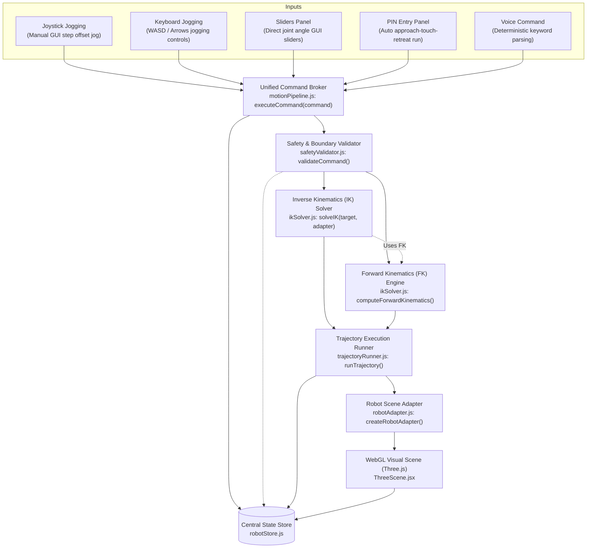
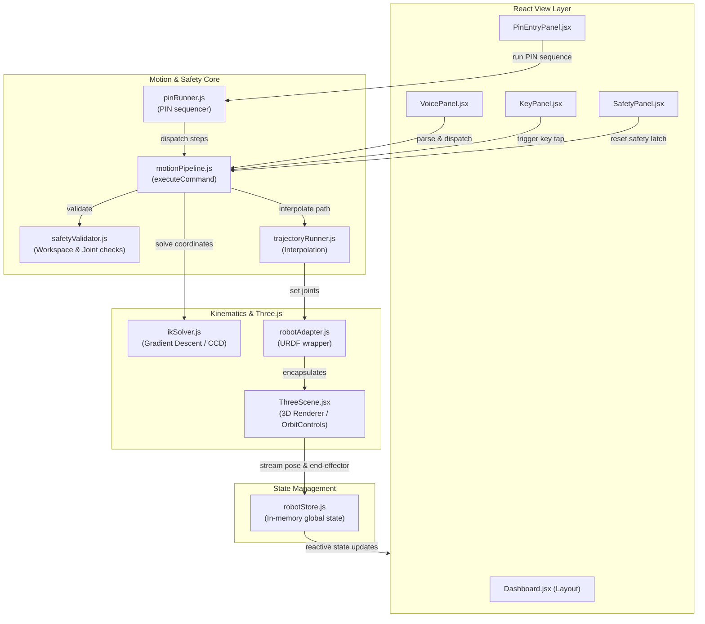

# Vantage Arm — System Architecture & Motion-Control Pipeline

This document outlines the detailed system architecture and execution pipeline of the **Vantage Arm** 6-DOF robotic simulation suite. It serves as a comprehensive reference for judging and technical review.

> [!IMPORTANT]
> **Single Shared Pipeline Rule**
> The system enforces a strict single-entry motion control pipeline: **all** inputs (UI controls, keyboard, voice, and autonomous routines) must construct a structured command and dispatch it via the central entry point: `executeCommand(command)`.

---

## 1. Overall Motion-Control Pipeline Flow
This diagram illustrates the step-by-step lifecycle of a command as it flows from an input trigger through safety validation, kinematic resolution, trajectory execution, and finally to the visual updates of the 3D model.

---

## 2. Component Relationship Diagram
This diagram shows how different architectural blocks of the application are integrated. It highlights the boundary between the **React UI layer**, the **central state store**, the **kinematic engine**, and the **Three.js rendering engine**.

---

## 3. Detailed Component Breakdown

| File Name | Domain | Primary Responsibility | Key Features |
| :--- | :--- | :--- | :--- |
| `commandTypes.js` | Core | Defines the structural schemas, scales, and types for all commands. | Enforces strict validation shapes; prevents corrupted command payloads. |
| `motionPipeline.js` | Core | Orchestrates execution, coordinates logging, and delegates actions. | Single entry point (`executeCommand`); manages trajectory execution and target markers. |
| `safetyValidator.js` | Core | Validates commands against physical constraints via `validateCommand()`. | Checks workspace Cartesian bounds (cylinder/floor) and joint limits (min/max/lower/upper). |
| `robotStore.js` | Core | In-memory central state management (`robotStore.js`). | Subscribable active telemetry store; records active commands, safety states, and real-time joint positions. |
| `trajectoryRunner.js` | Core | Computes and interpolates paths between poses via `runTrajectory()`. | Interpolates joint values dynamically via requestAnimationFrame with easeInOutCubic. |
| `pinRunner.js` | Core | Coordinates autonomous PIN sequences. | Translates 6-digit sequence to individual key movements (approach $\to$ touch $\to$ retreat). |
| `ikSolver.js` | Robotics | Resolves kinematics equations for the 6-DOF arm. | Houses both the Inverse Kinematics solver (`solveIK` with GD + CCD and perturbation retries) and the Forward Kinematics engine (`computeForwardKinematics`). |
| `robotAdapter.js` | Robotics | Bridges the motion pipeline with the 3D visual simulation via `createRobotAdapter()`. | Reads joint angles, calculates world transforms, and handles target/hit key flashes. |
| `voiceCommandParser.js`| Controls | Parses text/speech inputs into structured commands. | Handles digit-word replacement, trailing punctuation removal, and degree symbol (`°`) conversion. |

---

## 4. Key Engineering & Integration Patterns

### A. The No-Bypass Safety Gate
Every command passing through `executeCommand` is subjected to validation in `safetyValidator.js`. If a boundary is crossed or a limit is breached:
1. The execution is halted immediately.
2. The global safety latch is tripped (`safety.lastValid = false`).
3. The system rejects all subsequent movement commands until an operator explicitly triggers `resetSafety`.

### B. Singularity Resolution (Straight-Arm Issue)
When the robotic arm starts from its straight-up home pose ($[0,0,0,0,0,0,0]$), it sits in a **coordinate singularity**. In this state, small changes to individual joints do not improve the vertical distance error without increasing the horizontal error, causing simple gradient descent and CCD solvers to fail.

To resolve this, our IK Solver applies a **Perturbation Retry Loop**:
* **Pass 1**: Tries solving starting from the current angles.
* **Pass 2 & 3 (Perturbed)**: If Pass 1 fails to converge, it applies a slight alternating offset ($\pm 0.15\text{ rad}$) to the pitch joints (`joint_2`, `joint_3`, `joint_5`, `stylus_pitch`). This bends the virtual kinematic chain, breaking collinearity, and generating non-zero gradients. The solver converges successfully and moves the physical joints smoothly to the solved state.

### C. Robust Voice Parser Normalization
Speech recognition transcripts often contain formatting variation depending on browser engine and punctuation style. The parser normalizes input by:
* Stripping trailing punctuation (e.g., `"move up."` $\to$ `"move up"`).
* Converting spoken number words to digits (e.g., `"five"` $\to$ `"5"`).
* Normalizing the degree symbol (`"30°"` $\to$ `"30 degrees"`).

---

## 5. How to Import Diagrams into Draw.io

You can convert these visual Mermaid diagrams into editable vector files in Draw.io instantly:

1. Open [draw.io](https://app.diagrams.net/).
2. Select **+ Insert** (or the `+` icon in the top toolbar).
3. Navigate to **Advanced** $\to$ **Mermaid**.
4. Copy one of the Mermaid code blocks from above, paste it into the text box, and click **Insert**.
5. Draw.io will automatically generate an editable diagram with nodes and arrows.
